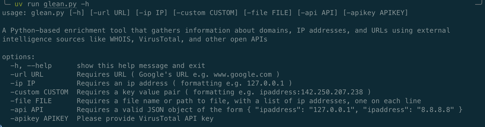

# Glean
A Python-based enrichment tool that gathers information about domains, IP addresses, and URLs using external intelligence sources like WHOIS, VirusTotal, and other open APIs 

## Set up environment 

- Clone the repository

  `git clone https://github.com/ssolan5/Glean.git`

- Change into the project directory
- Install uv, a tool for handling virtual enviroments for python, (only tested on mac system environments as of now)
  - brew command to install - `brew install uv`
  
- Initialize the uv environment

  `uv init`
  
- Add the dependencies

  `uv add aiohttp asyncio ipaddress python-whois vt-py`

- Run the program
  
  `uv run glean.py -h`

## Usage

### Example Usage 

- `uv run glean.py -file <file_path_goes_here> -apikey <virus_total_api_key_goes_here>`
- `uv run glean.py -url www.google.com -apikey <virus_total_api_key_goes_here>`
- `uv run glean.py -ip 8.8.8.8 -apikey <virus_total_api_key_goes_here>`
- `uv run glean.py -custom ipaddress:8.8.8.8 -apikey <virus_total_api_key_goes_here>`
- `uv run glean.py -api '{ "ipaddress": "8.8.8.8" }' -apikey <virus_total_api_key_goes_here>`
- `uv run glean.py -api '{ "ipaddress": "8.8.8.8", "ipaddress": "1.1.1.1" }' -apikey <virus_total_api_key_goes_here>`
